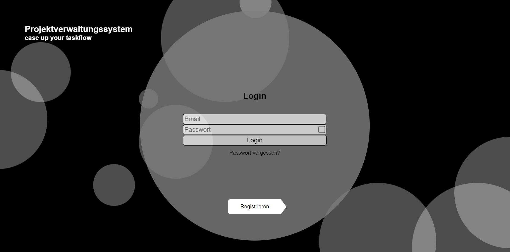

# IssueTracker Frontend in React und TypeScript

Das Frontend meines Issue Tracker Projekts mit der Nutzung von React und TypeScript. Bisher gibt es 3 Stufen von Usern und eine Chatfunktion ist implementiert.
Ich habe mich schon vorher bei einem kleinen Projekt an TypeScript versucht und hier habe ich mir vorgenommen TypeScript an einem größeren Projekt anzuwenden.
Der beste Weg zum erlernen neuer Skills.
Ich habe mich auch daran versucht einen eigenen Partikeleffekt umzusetzen. Für den ersten Versuch funktioniert es ganz gut (siehe Screenshot).

## Tools

## Screenshot

## Demo

coming soon

## Authors

[Metin Karakaya](https://github.com/KarakayaMetin8787)
